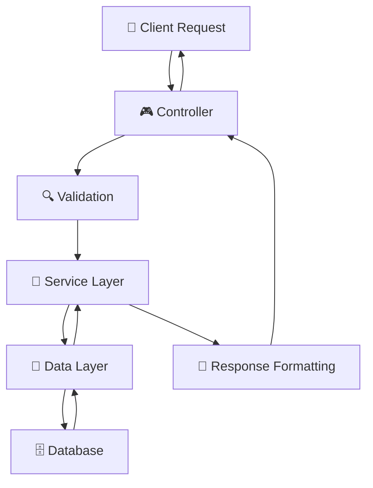

# 🏗️ House of 30mL - Project Structure Guide

## 📋 **Overview**

This document provides a comprehensive guide to the **House of 30mL Order Service** project structure, explaining each component and its role in the application.

---

## 🎯 **Project Architecture**

```
House of 30mL Order Service
├── 📱 Frontend Apps (Mobile/Web) 
├── 🌐 API Gateway
├── 🎮 Order Service (This Project)
├── 💾 MySQL Database
├── 💳 Razorpay Payment Gateway
└── ☁️ AWS S3 Storage
```

---

## 📁 **Directory Structure**

```
orderService-main/
├── 📄 pom.xml                    # Maven dependencies
├── 📄 Dockerfile                 # Container configuration
├── 📄 startup.sh                 # AWS secrets startup script
├── 📄 README.md                  # Basic project info
├── 📁 Jar/                       # Built JAR files
├── 📁 src/
│   ├── 📁 main/
│   │   ├── 📁 java/com/houseOf30ml/orderService/
│   │   │   ├── 🚀 OrderServiceApplication.java
│   │   │   ├── 📁 config/         # Configuration classes
│   │   │   ├── 📁 controller/     # REST API endpoints
│   │   │   ├── 📁 service/        # Business logic
│   │   │   ├── 📁 datalayer/      # Database access
│   │   │   ├── 📁 model/          # Request/Response DTOs
│   │   │   ├── 📁 exception/      # Custom exceptions
│   │   │   ├── 📁 helpers/        # Helper utilities
│   │   │   └── 📁 utils/          # Common utilities
│   │   └── 📁 resources/
│   │       ├── ⚙️ application.properties
│   │       ├── 📁 templates/      # HTML templates
│   │       ├── 📁 static/         # Static assets
│   │       └── 📁 invoices/       # Generated PDFs
│   └── 📁 test/                   # Test classes
└── 📄 mvnw, mvnw.cmd             # Maven wrapper
```

---

## 🎮 **Controllers Layer** (API Endpoints)

### **Purpose:** Handle HTTP requests and responses

| Controller | Base Path | Responsibility |
|------------|-----------|----------------|
| `ApplicationVersionController` | `/application` | App version info |
| `CartController` | `/cart/test` | Shopping cart operations |
| `OrderController` | `/orders/test` | Order management |
| `PaymentController` | `/payment/test` | Payment processing |
| `WalletController` | `/wallet` | Wallet operations |
| `ReservationController` | `/reservation` | Table reservations |
| `QRController` | `/qr` | QR code generation |
| `RdeemController` | `/redeem` | Drink redemption |
| `ExclusiveDayController` | `/CheckExclusiveDay/test` | Special day checks |

### **Key Features:**
- ✅ Input validation using `OrderHelper`
- ✅ Exception handling with try-catch blocks
- ✅ Standardized response format
- ✅ Request/Response logging

---

## 🧠 **Service Layer** (Business Logic)

### **Purpose:** Process business rules and coordinate data operations

| Service | Responsibility |
|---------|----------------|
| `OrderService` | Order processing, status management |
| `CartService` | Cart operations, price calculations |
| `PaymentService` | Razorpay integration, payment processing |
| `WalletService` | Wallet balance, transactions |
| `ReservationService` | Table booking logic |
| `RedeemService` | Drink redemption processing |
| `QRService` | JWT token generation for QR codes |
| `InvoiceService` | PDF invoice generation |
| `NotificationService` | User notifications |
| `OwnerDashboardService` | Pub owner analytics |

### **Key Features:**
- ✅ Business rule validation
- ✅ Transaction management
- ✅ External API integration
- ✅ Async processing for heavy operations

---

## 💾 **Data Layer** (Database Access)

### **Structure:**
```
datalayer/
├── 📄 DbAccessClient.java          # Main interface
├── 📄 SqlDbAccessClient.java       # SQL implementation
├── 📄 ExternalDbAccessClient.java  # External API client
├── 📄 PaymentClient.java           # Payment gateway client
├── 📁 dbModels/                    # JPA entities
├── 📁 repository/                  # JPA repositories
├── 📁 responseModels/              # Database response DTOs
├── 📁 config/                      # Data layer config
├── 📁 helpers/                     # Database helpers
└── 📁 utils/                       # Database utilities
```

### **Database Entities:**

| Entity | Purpose | Key Fields |
|--------|---------|------------|
| `User` | Customer information | userId, email, contactNum, name |
| `Drink` | Beverage catalog | drinkId, name, price, alcoholPercentage |
| `Combos` | Combo deals | comboId, comboName, price |
| `Cart` | Shopping cart | userId, drinkId, quantity |
| `Order` | Order records | orderId, userId, totalAmount |
| `OrderItem` | Order line items | orderItemId, orderId, drinkId, quantity |
| `Payment` | Payment transactions | paymentId, orderId, status |
| `Reservation` | Table bookings | reservationId, userId, pubId, startTime |
| `Pub` | Venue information | pubId, pubName, address |

### **Repository Pattern:**
- **JPA Repositories** for CRUD operations
- **Custom Queries** using `@Query` annotations
- **Repository Calls** wrapper classes for complex operations

---

## 📝 **Model Layer** (Data Transfer Objects)

### **Structure:**
```
model/
├── 📁 request/     # API request models
└── 📁 response/    # API response models
```

### **Request Models:**
| Model | Purpose |
|-------|---------|
| `CreateReservationRequest` | Table booking request |
| `ChangeCartReq` | Cart modification request |
| `CreateRedeemReq` | Drink redemption request |
| `JWTRedeemInfo` | QR token information |
| `JWTReservationInfo` | Reservation QR data |

### **Response Models:**
| Model | Purpose |
|-------|---------|
| `GetCartResp` | Cart items response |
| `MyOrdersResp` | User orders response |
| `CreateReservationResponse` | Reservation creation result |
| `Status` | Standard status wrapper |
| `MediaResp` | Image/media information |

---

## ⚙️ **Configuration Layer**

### **Configuration Classes:**

| Config | Purpose |
|--------|---------|
| `AsyncConfig` | Thread pool for async operations |
| `AmazonS3Config` | AWS S3 client configuration |
| `RestTemplateConfig` | HTTP client with API key interceptor |

### **Key Settings:**
- **Database Connection:** MySQL with HikariCP
- **JWT Secrets:** For QR token generation
- **Payment Gateway:** Razorpay credentials
- **AWS S3:** Invoice storage configuration
- **Logging:** File-based logging configuration

---

## 🛠️ **Utilities & Helpers**

### **Utilities:**
| Utility | Purpose |
|---------|---------|
| `ErrorHandlingUtils` | Centralized error handling |
| `QrTokenUtils` | JWT token operations |
| `RequestValidationUtils` | Input validation |

### **Helpers:**
| Helper | Purpose |
|--------|---------|
| `OrderHelper` | Order processing utilities |
| `CheckExclusiveDay` | Special day validation |
| `DateComparison` | Date utility functions |
| `ProfileImageHelper` | Image processing |

---

## 🔧 **Exception Handling**

### **Custom Exceptions:**
- `ValidationException` - Input validation errors
- `DbAccessException` - Database operation errors
- `CustNotFoundException` - Resource not found errors

### **Error Handling Strategy:**
1. **Controller Level:** Catch and format exceptions
2. **Service Level:** Business logic validation
3. **Data Layer:** Database operation errors
4. **Global Handler:** Centralized error processing

---

## 🚀 **Application Flow**

### **Typical Request Flow:**


### **Key Processing Steps:**
1. **Request Reception:** Controller receives HTTP request
2. **Input Validation:** Validate required parameters
3. **Business Processing:** Service layer applies business rules
4. **Data Operations:** Database queries and updates
5. **Response Generation:** Format and return response
6. **Error Handling:** Catch and handle any exceptions

---

## 📊 **Database Design**

### **Key Relationships:**
- `User` → `Order` (One-to-Many)
- `Order` → `OrderItem` (One-to-Many)
- `User` → `Cart` (One-to-Many)
- `User` → `Reservation` (One-to-Many)
- `Pub` → `Drink` (Many-to-Many via PubDrinkMapping)

### **Indexing Strategy:**
- Primary keys on all entities
- Foreign key indexes for relationships
- Composite indexes for frequent queries

---

## 🔐 **Security Implementation**

### **Authentication:**
- API Key validation for all requests
- JWT tokens for QR code authentication
- Request signature validation for webhooks

### **Data Protection:**
- Input sanitization and validation
- SQL injection prevention via JPA
- Sensitive data encryption in transit

---

## 📈 **Performance Considerations**

### **Optimization Techniques:**
- **Connection Pooling:** HikariCP for database connections
- **Async Processing:** Background tasks for heavy operations
- **Caching:** Strategic caching of frequently accessed data
- **Query Optimization:** Efficient database queries

### **Monitoring:**
- Spring Actuator health checks
- Application logging
- Performance metrics tracking

---

## 🚀 **Deployment Architecture**

### **Container Setup:**
- **Base Image:** OpenJDK 17 slim
- **Dependencies:** AWS CLI, jq for secrets management
- **Environment:** Configurable via environment variables
- **Startup:** Custom script for AWS secrets integration

### **Environment Configuration:**
- **Development:** Local MySQL, test credentials
- **Staging:** Shared database, staging payment gateway
- **Production:** Production database, live payment processing

---

This structure ensures **maintainability**, **scalability**, and **clear separation of concerns** throughout the application! 🎯
